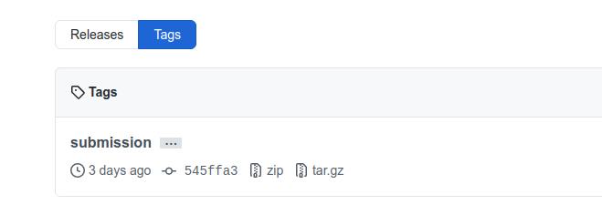

# FAQ - Pacman Projects - RMIT AI 2021

This is a FAQ only for the project assessments (i.e., Pacman projects).

For general questions about the course, refer to the other FAQs available under [Resources](https://edstem.org/courses/6081/resources).

As any FAQ page, this page is always "under construction". As we realize that some questions become common, we add them here.

- [FAQ - Pacman Projects - RMIT AI 2021](#faq---pacman-projects---rmit-ai-2021)
- [GENERAL](#general)
  - [In a code assignment/project, how do I make sure I do not go against academic integrity?](#in-a-code-assignmentproject-how-do-i-make-sure-i-do-not-go-against-academic-integrity)
  - [Cannot access the Google Form, says I need permission](#cannot-access-the-google-form-says-i-need-permission)
  - [Git, GitHub, what is that?](#git-github-what-is-that)
  - [How do I submit my project solution in my GIT repository?](#how-do-i-submit-my-project-solution-in-my-git-repository)
  - [How do I change the submission tag if I have already tagged one commit for submission?](#how-do-i-change-the-submission-tag-if-i-have-already-tagged-one-commit-for-submission)
  - [I submitted wrongly (e.g., didn't tag correctly) and is now after the due date, can you consider my submission?](#i-submitted-wrongly-eg-didnt-tag-correctly-and-is-now-after-the-due-date-can-you-consider-my-submission)
  - [Project specification says "You should code your implantation only at the locations ...." . Does this mean that we can't create our custom classes outside the provided functions?](#project-specification-says-you-should-code-your-implantation-only-at-the-locations---does-this-mean-that-we-cant-create-our-custom-classes-outside-the-provided-functions)
  - [How do I zip files in folder X without including the folder X itself?](#how-do-i-zip-files-in-folder-x-without-including-the-folder-x-itself)
  - [The autograder says _"Your grades are NOT yet registered."_ What should I do to register?](#the-autograder-says-your-grades-are-not-yet-registered-what-should-i-do-to-register)
  - [Should I pass all the autograder tests?](#should-i-pass-all-the-autograder-tests)
- [PACMAN SETUP](#pacman-setup)
  - [What is the best way to develop my solutions for the Pacman project?](#what-is-the-best-way-to-develop-my-solutions-for-the-pacman-project)
  - [What version of Python should I use?](#what-version-of-python-should-i-use)
  - [How do I run Python 3.6 in `coreteachingXX.csit.rmit.edu.au`??](#how-do-i-run-python-36-in-coreteachingxxcsitrmiteduau)
  - [How to run Pacman remotely from `coreteaching`?](#how-to-run-pacman-remotely-from-coreteaching)
  - [Coreteaching? What is that?](#coreteaching-what-is-that)
  - [How do I setup a system in Windows with Python 3.6?](#how-do-i-setup-a-system-in-windows-with-python-36)
- [TROUBLESHOOTING](#troubleshooting)
  - [Can I use `problem._visited`?](#can-i-use-problem_visited)
  - [I get "`_tkinter.TclError: no display name and no $DISPLAY environment variable`" error when running in WSL or ssh](#i-get-_tkintertclerror-no-display-name-and-no-display-environment-variable-error-when-running-in-wsl-or-ssh)
  - [Cannot run Pacman due to problems with Tkinter: "`ImportError: No module named Tkinter`"](#cannot-run-pacman-due-to-problems-with-tkinter-importerror-no-module-named-tkinter)
  - [How do I know the type of a variable in Python?](#how-do-i-know-the-type-of-a-variable-in-python)
  - [Error module 'cgi' has no attribute 'escape' when running autograder.pt](#error-module-cgi-has-no-attribute-escape-when-running-autograderpt)
  - [Can't fit the Pacman window in my screen, can I resize it?](#cant-fit-the-pacman-window-in-my-screen-can-i-resize-it)
  - [Cannot compile Metric-FF in MacOS](#cannot-compile-metric-ff-in-macos)
  - [One of the many tests is failing, how can I just run one question or even one particular test only?](#one-of-the-many-tests-is-failing-how-can-i-just-run-one-question-or-even-one-particular-test-only)
- [Project 1](#project-1)
  - [What actions should I return in the search algorithms?](#what-actions-should-i-return-in-the-search-algorithms)
  - [What counts as an expansion? I am getting too many expansions....](#what-counts-as-an-expansion-i-am-getting-too-many-expansions)
  - [My solution works manually for `tinaMaze` but the authograder fails. The state format used in the autogarders tests are different from the Pacman game's in `tinaMaze`. What happens here?](#my-solution-works-manually-for-tinamaze-but-the-authograder-fails-the-state-format-used-in-the-autogarders-tests-are-different-from-the-pacman-games-in-tinamaze-what-happens-here)
- [Project 2](#project-2)
  - [Inconsistent depth in minimax project 2, Q2 and careful use of `__init__`](#inconsistent-depth-in-minimax-project-2-q2-and-careful-use-of-__init__)
  - [Can we apply a "magic number" such as -9999 in our evaluation functions, as part of our logic not simply an arbitrary "return -9999"?](#can-we-apply-a-magic-number-such-as--9999-in-our-evaluation-functions-as-part-of-our-logic-not-simply-an-arbitrary-return--9999)
- [Capture the Flag](#capture-the-flag)
  - [How to load my additional files beyond myTeam.py?](#how-to-load-my-additional-files-beyond-myteampy)
  - [Games go too fast! What should I do?](#games-go-too-fast-what-should-i-do)
  - [How do I replay a game?](#how-do-i-replay-a-game)
  - [How does one check if a given agent is currently scared? Is the only option to check the number of capsules in previous states?](#how-does-one-check-if-a-given-agent-is-currently-scared-is-the-only-option-to-check-the-number-of-capsules-in-previous-states)
  - [It looks like the distance calculator is performing calculations in the background of our turns, can we replace it with our own version that does more?](#it-looks-like-the-distance-calculator-is-performing-calculations-in-the-background-of-our-turns-can-we-replace-it-with-our-own-version-that-does-more)
  - [Can we re-use code from Project 2?](#can-we-re-use-code-from-project-2)
  - [Ugly rendering of graphics under MacOs?](#ugly-rendering-of-graphics-under-macos)
  - [How to call a planner like (like `ff`) or any another external tool?](#how-to-call-a-planner-like-like-ff-or-any-another-external-tool)
  - [What does it mean that we must use 2/3 AI techniques? Do they all need to be part of the final submission?](#what-does-it-mean-that-we-must-use-23-ai-techniques-do-they-all-need-to-be-part-of-the-final-submission)
  - [Can I use library or program X (e.g., tensorflow, FF planner, etc.)?](#can-i-use-library-or-program-x-eg-tensorflow-ff-planner-etc)
  - [I have performance problem with `generateSuccessor` in my search implementation, why?](#i-have-performance-problem-with-generatesuccessor-in-my-search-implementation-why)
  - [I want to update an enemy position that's not in my sight range. I need to assign the position information in a copy of `gameState`. But I could only get an Agent Position not set.](#i-want-to-update-an-enemy-position-thats-not-in-my-sight-range-i-need-to-assign-the-position-information-in-a-copy-of-gamestate-but-i-could-only-get-an-agent-position-not-set)
  - [The Berkeley site claims that observations are noisy unless the other agent is nearby, but when I call `getAgentPosition` it gives the exact location of any agent, including opponents.](#the-berkeley-site-claims-that-observations-are-noisy-unless-the-other-agent-is-nearby-but-when-i-call-getagentposition-it-gives-the-exact-location-of-any-agent-including-opponents)
  - [What does the "Score Balance" mean?](#what-does-the-score-balance-mean)
  - [Is there any way to determine how long is left in a game? The Berkley spec it says 'games are limited to 1200 agent moves'. Will this limit also be the same for our tournament?](#is-there-any-way-to-determine-how-long-is-left-in-a-game-the-berkley-spec-it-says-games-are-limited-to-1200-agent-moves-will-this-limit-also-be-the-same-for-our-tournament)
  - [Can I override the `X` (e.g., `makeObservation()`) method of `CaptureAgent`?](#can-i-override-the-x-eg-makeobservation-method-of-captureagent)
  - [How to simulate opponent in MCTS?](#how-to-simulate-opponent-in-mcts)
  - [The option `--numTraining` (or `-x`) option does not work, why?](#the-option---numtraining-or--x-option-does-not-work-why)

-------------------------

# GENERAL

## In a code assignment/project, how do I make sure I do not go against academic integrity?

Check the [answer to this key question here](https://docs.google.com/document/d/1AQAU7cH9zgsneTAfig-afBoVfPCi6t1k2nBzFfhdBfc/edit?usp=sharing)

## Cannot access the Google Form, says I need permission

If you see something like this:


then chances are you are not correctly logged into your uni account or you are logged with your private Google account and your browser cannot distinguish. Either open it on an incognito browser window or make sure you are logged into your uni account. There is nothing I can do from my side if you don't access the form with the right authentication credentials.

## Git, GitHub, what is that?

We will use proper (git) version control in all our programming projects. This is totally standard practice in the industry and you would have seen that in previous courses (SEF and SEPT at least). Said so, if you want to refresh or have a quick intro to it, here are two resources I found useful:

- [30' video on Git & GitHub](https://youtu.be/jG4Vs81kMlc).
- [GitHub Guides](https://guides.github.com/).
- [Git \& GitHub Tutorial & Reference @ Javatpoint](https://www.javatpoint.com/git).

There are lots more good resources on the web of course!
## How do I submit my project solution in my GIT repository?

You submit by **tagging the _exact_ commit that you want to submit and be marked**, using the exact name given in the assignment specification. We will ONLY marked tagged submissions and will ONLY mark the tagged commit. Students can have many commits, and branches, even commits after the deadline. We will mark ONLY what you submit.

Of course we do not have access to your local machine, so the tag has to be done or pushed into GitHub server repo (see below for several guides). Your tag has to show under `tags`, for example:



Observe that a tag is:

- NOT the same as a branch called "`submission`";
- NOT the same as a commit message "`submission`"; and
- NOT the same as a release called "`submission`".

A tag is a specific point in the repository history, the point you want to be used for marking. A branch, a comment, and a release are different things. 

Note that a tag is a unique name and is case-sensitive, you cannot have commits tagged with the same name and `Submission` is not the same as `submission`. So if you have submitted a version by tagging it and you want to change the commit submission, you first need to delete the existing tag and then re-tag the good commit; see next question for that.

- For basic information on tagging, check [here](https://git-scm.com/book/en/v2/Git-Basics-Tagging). 
- To create, push, and view tags in GitHub Desktop, check [here](https://docs.github.com/en/desktop/contributing-to-projects/managing-tags). 
- To tag via command line or via GitHub web interface, check [here](https://stackoverflow.com/questions/18216991/create-a-tag-in-a-github-repository). 

Note that the timestamp of the commit is the submission date.

See next questions to change the submission tag you have already done (i.e., you want to update your submission to another point in the repo history, usually a more recent one).

## How do I change the submission tag if I have already tagged one commit for submission?

This will happen when you realize you have a better version to submit than the one you submitted/tagged before. To do that, you need to delete the tag (from your local repo and from the server):

- First delete it from the GIT server by running: `git push --delete origin <tagname>`
- Second, delete the local tag in your repo by running: `git tag --delete tagname`

More information on how to delete git tags [here](https://devconnected.com/how-to-delete-local-and-remote-tags-on-git/).

See this as well:


It used to be the case that GitHub web interface did not allow deleting tags (though you could create new tags); but post [@120](https://piazza.com/class/kbsmlzxg3k7418?cid=120) suggests that it is now possible to change a tag from the GitHub web interface!

## I submitted wrongly (e.g., didn't tag correctly) and is now after the due date, can you consider my submission?

We will not fix any submission and it is your responsibility to do it correctly.

However, the nice thing about git-based projects/assessments is that we can rely on commits. If you have submitted your tag incorrectly (did not tag it at all, tagged with different name or different capital letters), then please fix your submission by tagging the specific commit you want me to mark. I will use the timestamp of the commit itself, not of when it was tagged. This means that if the commit was done before the deadline, then all good!! Isn't this cool?

## Project specification says "You should code your implantation only at the locations ...." . Does this mean that we can't create our custom classes outside the provided functions?

Yes, you can create some help functions or classes, but **always** in the allowed files. Any other change in any other file will be totally ignored.

If you want to create custom classes and functions, you can also nest them inside the location where you read `***YOUR CODE HERE***`. See [this link](https://www.datacamp.com/community/tutorials/inner-classes-python) and [this link](https://www.programiz.com/python-programming/closure#:~:text=A%20function%20defined%20inside%20another,in%20order%20to%20modify%20them) for more info.

## How do I zip files in folder X without including the folder X itself?

Use the `-j` option, for example:

```bash
$ zip -r -j myAgent.zip project-2/MySolution/ 
```

However, this is OK if you don&rsquo;t need ANY folder at all in the zip, everything in the root. If you just don&rsquo;t want the root folder included but you do want all the folders after that to be included:

```bash
$ rm -f myAgent.zip ; cd project-2/MySolution; zip -r -j ../../myAgent.zip * ; cd ..
```

## The autograder says _"Your grades are NOT yet registered."_ What should I do to register?

The autograder is some immediate **feedback** for you, but it is not the final grading we do as teaching staff.  

So, while the automarker is a useful indication of your performance, it may not represent the ultimate mark. We reserve the right to run more tests, inspect your code and repo manually, run similarity software for integrity checks (this year via [Codequiry](https://codequiry.com/)), and arrange for a face-to-face meeting for a discussion and demo of your solution if needed.

After submission deadline we will mark them all and provide you with the results.


## Should I pass all the autograder tests?

Well, if you want to have a chance to get full marks _yes_. 

So, the short answer is that you should try to pass the test cases provided.

If your solution does not meet those test cases, it is not exactly what we are looking for (it may still get some marks).  Even if your solution does meet every test case given, it still does not necessarily mean it is perfect, and we may run additional tests when we grade.

We are aware that it can be a bit unforgiving to work with the automated test harness, but often your understanding of the underlying algorithms are greatly improved when you need to dig into particular corner cases, so it's time well spent. 


------------------------------
# PACMAN SETUP

## What is the best way to develop my solutions for the Pacman project?

We highly recommend developing your solutions in your local machine (e.g., your laptop). Even more, if you are running Linux locally, 99.99% sure your code will ran in another Linux install. If you are using Windows, you may want to consider installing a Linux virtual machine with Virtualbox.

Running it locally will make the development much faster. I also strongly suggest using a version control system, like git or mercurial. This is best practice and should be something normal at this stage of the program. Remember though NOT to make your solutions public and this will violate the course plagiarism code AND also break the will of the creators of this wonderful project. SO if you use bitbucket for example, make sure your repository is private.

## What version of Python should I use?

All projects run on **Python 3.6**, so your code must be written for such a version. Please note the original project from UC runs in Python 2.7. 

**Note**: Some Linux distributions come with both python2 and python3 installed but default to python2 for the python command. In this case, you should use the python3 command in place of python to explicitly use version 3.x.

Additionally, in order to render the game, the homework projects require the Python module tkinter to be installed. You can follow the [official docs](https://tkdocs.com/tutorial/install.html) to get tkinter on your platform if it is not installed already. If you are using Linux, many distributions have packaged tkinter for easy install and you should use the package manager to install it. The package name is `python3-tk` for Debian/Ubuntu, python3-tkinter for RHEL/Fedora and tk for Manjaro/Arch.

There is no problem **having more than one Python version installed in your machine**, you just need to be careful your code is using the right one. You need to use Python Package and Environment Managers.

One good option is to use **Miniconda**, a minimalist version of Anaconda virtual environment variable to have both installations coexist in your machine (here are others these days, like pipenv)

The download page is [here](https://conda.io/miniconda.html) (install either the version for Python 2 or 3, it only affects the default environment, you can still install others).

After you install Miniconda, you can create new environments via 

```bash
$ conda create --name <env-name> python=3.6
```

For example, you can do:

```bash
$ conda create --name ai20 python=3.6
```

At that point, to active your ai20 environment:

```bash
$ source activate ai20
```

(on Windows; instructions for other OSs [here](https://conda.io/docs/using/envs.html#change-environments-activate-deactivate))

These commands will make your calls to `python` or `pip` run the correct version.

Example run (on Debian Linux, so the activation command is slightly different):

```bash
marco@w8103259:~$ source activate py27
discarding /home/marco/miniconda3/bin from PATH
prepending /home/marco/miniconda3/envs/py27/bin to PATH

(py27)marco@w8103259:~$ python --version
Python 2.7.12 :: Continuum Analytics, Inc.

(py27)marco@w8103259:~$ source activate py36
discarding /home/marco/miniconda3/envs/py27/bin from PATH
prepending /home/marco/miniconda3/envs/py36/bin to PATH

(py36)marco@w8103259:~$ python --version
Python 3.6.0 :: Anaconda 4.3.0 (64-bit)
```

As you can see, I have python 2.7 and 3.6 coexisting peacefully in my OS."

## How do I run Python 3.6 in `coreteachingXX.csit.rmit.edu.au`??

You need to activate it first using `scl`:

```bash
[e62439@csitprdap01 ~]$ scl enable rh-python36 bash
[e62439@csitprdap01 ~]$ python --version
Python 3.6.9
[e62439@csitprdap01 ~]$ python
Python 3.6.9 (default, Sep 11 2019, 16:40:19) 
[GCC 4.8.5 20150623 (Red Hat 4.8.5-16)] on linux
Type "help", "copyright", "credits" or "license" for more information.
```

## How to run Pacman remotely from `coreteaching`?

If you do not care about the graphics (e.g., for grading), then try using `--textGraphics` or even `--quietTextGraphics`. In most cases you will use `coreteaching` machines just to test that the autograder works well. The autograder does not need any graphical interface so it should work properly.

If you do want the display, then you need to do X forwarding when you connect via ssh. If you are in Linux/Unix this is easy, just do `-X` and `-Y` when you ssh; for example:

```shell
$ ssh -X -Y username@coreteaching01.csit.rmit.edu.au
```

If you use Windows, then you need an X server running and set your ssh client (e.g., Putty) with X forwarding. For example, check [this page](https://superuser.com/questions/119792/how-to-use-x11-forwarding-with-putty) or this video:

[](https://www.youtube.com/watch?v=vwZXhTykSis)


Said so, for development, we strongly suggest to clone your repo locally on your machine and work there (e.g., using PyCharm, Visual Code Studio, or even ECLIPSE).

## Coreteaching? What is that?

Check [this FAQ](https://docs.google.com/document/d/12CS_7OdEmpQZiwuxDTc9PHfHan4mGRwceT0t-kstKNc/edit) on RMIT coreteaching facilities.

## How do I setup a system in Windows with Python 3.6?

Although we will assume you are able to install and get Python running in your machine, there are plenty of videos on that on the web. For example: 

[](https://www.youtube.com/watch?v=oHOiqFs_x8Y)


------------------------------
# TROUBLESHOOTING

## Can I use `problem._visited`?

Under Python convention, single underscore before a name (e.g., `_visited`) denotes private data, and hence it is good practice not to rely on such data. Check [this post](https://shahriar.svbtle.com/underscores-in-python) for example. Note that such private data can change without notice, it may not be available anymore, it may not be available under other interfaces, etc. So.... 

## I get "`_tkinter.TclError: no display name and no $DISPLAY environment variable`" error when running in WSL or ssh

If you do not care about the graphics (e.g., for grading), then try using `--textGraphics` or even `--quietTextGraphics`. 

If you do want the display, then you need to do X forwarding when you connect via ssh. If you are in Linux/Unix this is easy, just do `-X` and `-Y` when you ssh (e.g., `ssh -X -Y server`).

If you use Windows, then you need an X server running and set your ssh client (e.g., Putty) with X forwarding. For example, check [this page](https://superuser.com/questions/119792/how-to-use-x11-forwarding-with-putty) and [this video](https://www.youtube.com/watch?v=vwZXhTykSis).

Said so, for development, **we strongly suggest** to clone your repo locally on your machine and work there (e.g., using PyCharm, Visual Code Studio).

## Cannot run Pacman due to problems with Tkinter: "`ImportError: No module named Tkinter`"

Install Tkinter:

```bash
$ conda install tk
```

Now it should be installed, so you should not get this error. But please try the code below, it should not trigger any error:

```bash
[e62439@foo~]$ scl enable rh-python36 bash
[e62439@foo~]$ python
Python 3.6.9 (default, Sep 11 2019, 16:40:19) 
[GCC 4.8.5 20150623 (Red Hat 4.8.5-16)] on linux
Type "help", "copyright", "credits" or "license" for more information.
>>> import tkinter
>>> 
>>> 
[e62439@foo~]$ 
```

## How do I know the type of a variable in Python?

Check this video to know how to print the type of a variable in Python:

[](https://www.youtube.com/watch?v=iROZLaQGy4s)

## Error module 'cgi' has no attribute 'escape' when running autograder.pt

You are probably not using Python 3.6 but a higher version. Check [this post](https://piazza.com/class/kbsmlzxg3k7418?cid=28).

## Can't fit the Pacman window in my screen, can I resize it?

The Pacman windows cannot be resized once open. However, you can use the option `-z <float>` (or `--zoom <float>`) to scale the window. For example, using `-z 0.5` will scale down the window by half. Using this option you should be able to fit the entire window in the screen.
## Cannot compile Metric-FF in MacOS

Some Mac users have reported this error when compiling [Metric-FF](https://fai.cs.uni-saarland.de/hoffmann/metric-ff.html) planner:


The problem seems to be that the default `gcc` in Mac is set to be `clang`. So, you first neeed to install standard `gcc` on using command `brew install gcc@7`  (must use version 7, newest version 10 won't work) and instead of just `make`, you need to run:

```bash
make CC=/usr/local/bin/gcc-7
```

Thanks Banhao from AI'20!

## One of the many tests is failing, how can I just run one question or even one particular test only?

Use the `-q n` option for running just one question (e.g., `-q q3` to run Question 3 only) or `-t` to run only a specific test (e.g., `-t test_cases/q1/graph_bfs_vs_dfs`).


-----------------
# Project 1

## What actions should I return in the search algorithms?

Check the actions in this class in games.py

```python
class Directions:
NORTH = 'North'
SOUTH = 'South'
EAST = 'East'
WEST = 'West'
STOP = 'Stop'
```

## What counts as an expansion? I am getting too many expansions....

Basically, every time you call `problem.getSuccessors(.)`. 

(It is not popping out from the queue, as we don't have access to that part of your code!)

So be careful not using that function for more than what is needed. :-)

One can implement the various search algorithms (e.g., DFS) doing one call to `getSuccessor()` per loop/node, as in the pseudo-code (e.g., book or slides).

## My solution works manually for `tinaMaze` but the authograder fails. The state format used in the autogarders tests are different from the Pacman game's in `tinaMaze`. What happens here?

Indeed, the test cases often have atomic states instead of `(x,y)` coordinates, but this should not affect your code at all. From the algorithms perspective, a state is (just) a "state", regardless of the representation. The autograder often checks corner cases which are not tested by the standard mazes, which may be why you see it failing (despite your manual cases working).

-----------------
# Project 2

## Inconsistent depth in minimax project 2, Q2 and careful use of `__init__`

Taken from Andrew's and other student fantastic answer in post @140 

So it looks like this issue is due to issues in calling constructors of parent classes (i.e. `__init__`). This can be a bit tricky, so here is the takeaway that is needed for this project:

If you want to add an `__init__` method into any (or all) of `MinimaxAgent`, `AlphaBetaAgent`, or `ExpectimaxAgent`, it should look like this:

```python
class MinimaxAgent(MultiAgentSearchAgent):
def __init__(self, **kwargs):
"*** YOUR CODE HERE ***"
super().__init__(**kwargs)
```

This ensures that you aren't interfering with the arguments being passed through to the `MultiAgentSearchAgent` subclass. For anyone who wants to know why you need to do this and what that means, keep reading.

Let's imagine you want to add something to the constructor (i.e. the `__init__` method) of `MinimaxAgent`, for whatever reason. Your first attempt might look like: 

```python
class MinimaxAgent(MultiAgentSearchAgent):
def __init__(self):
self.foo = 0 # initialise foo
```

This should fail with the following `error: TypeError: __init__()` got an unexpected keyword argument 'depth'.

Why is that? Well, the test harness is trying to call `__init__()` on `MultiAgentSearchAgent` to pass in the depth (and potentially evalFn) argument. Your new constructor now overwrites the original constructor of `MultiAgentSearchAgent`, and it isn't expecting any arguments, hence the error. What you want to do is call the parent constructor from within your constructor, to make sure that you aren't interfering with the original code. You can try to do so with the `super()` keyword like so:

```python
class MinimaxAgent(MultiAgentSearchAgent):
def __init__(self):
self.foo = 0 # initialise foo
super().__init__()
```

But this still gives the same error, as you haven't passed through the arguments. You can pass them through manually like so:

```python
class MinimaxAgent(MultiAgentSearchAgent):
def __init__(self, evalFn = 'scoreEvaluationFunction', depth = '2'):
self.foo = 0 # initialise foo
super().__init__(evalFn, depth)
```

However this runs into a number of problems:

If you have multiple parent classes (either directly or indirectly), you don't know which arguments to pass.
It duplicates code (including default arguments), now a change to one class needs to be made in many places.
It requires you to know exactly what the parent class is doing, which is not ideal. 

This is where `**kwargs` comes in. For our purposes we can think of `**kwargs` as a dictionary that store an unlimited number of keyword arguments to a function, where we don't have to know what they are. This allows you to pass then on to other functions from parent classes, but you can also access them like any other dictionary:

```python
class MinimaxAgent(MultiAgentSearchAgent):
def __init__(self, **kwargs):
self.foo = 0 # initialise foo
print("Minimax depth: ", kwargs['depth'])
super().__init__(**kwargs)
```


More details about super can be found [here](https://stackoverflow.com/questions/2399307/how-to-invoke-the-super-constructor-in-python) (although it lacks discussion of arguments), and details about kwargs [here](https://stackoverflow.com/questions/3394835/use-of-args-and-kwargs)

## Can we apply a "magic number" such as -9999 in our evaluation functions, as part of our logic not simply an arbitrary "return -9999"?

You would not be marked down for using a number like that - however if you really want a very large number, you might consider using `math.inf` instead, or even `float('inf')`.


-----------------
# Capture the Flag

## How to load my additional files beyond myTeam.py?

You may have coded supported files that you will import in your `myTeam.py`, for example a module  `abc.py`. In order for the contest script to find it you need to do it this way:

```python
import os
import sys

cd = os.path.dirname(os.path.abspath(__file__))
sys.path.append(cd)

import abc 
```

If you do not append that to the sys path, your `abc.py` module will not be found and your agent will crash.


## Games go too fast! What should I do?

Use the `--delay-step` option. Note that option is NOT available in the standard UC-Berkeley distribution; I have added it.

## How do I replay a game?

You can play a game and use the `--record` option, you will be left with the game history to a file named by the time the game was played. You can replay these files using the `--replay` option and specifying the file to replay. You can use the `--replay-delay` to change the speed of the replay (see this is a feature in our distribution, not in the UC-Berkeley distribution). For example:

```bash
$ python capture.py --replay BBC_vs_It_depends_contest18Capture.replay --delay-step=0.1
```

All matches played in the preliminary contests are automatically recorded and the most recent ones can be viewed on the contest site. You are also able to download the history associated with each replay.

A new script [replay.py](https://drive.google.com/drive/folders/1LaqFVayH4cLp3_QW3ar3RVQ4-KuMm9xb?usp=sharing) is provided as well that can be used to select which replay to run from a collection of replays (obtained from the contest site). This is an extended version of the one developed by student Thomas and hosted [here](https://github.com/itsjfx/pacman-contest-replay-player). This makes running replays much easier!


## How does one check if a given agent is currently scared? Is the only option to check the number of capsules in previous states?

```python
GetAgentState(self.index).scaredTimer
```

##  It looks like the distance calculator is performing calculations in the background of our turns, can we replace it with our own version that does more?

The short answer is **no**, you cannot replace or change that code, but you can create your own version that you use instead. For the long answer, keep reading.

The premise to this question is a little off, the distancer is not doing any calculations on "your turns", it only calculates things _during the initialisation phase_. To be precise, that work is done during the `self.distancer.getMazeDistances()` call on line `105` of `captureAgents.py`, in the `registerInitialState` method of `CaptureAgent`. This will be called by all of your agents as you are subclassing `CaptureAgent`.
 
This shouldn't be an issue, as it will only take less than 1 second of your 15 second initialisation time (and even then only 1 second for the first agent). 
 After that, all the distances are cached, so you can get distances essentially for free in your code by calling `self.distancer.getDistance(p1, p2)`.

## Can we re-use code from Project 2?

If you were part of the team for Project 2, then yes, but you need to be careful how.

What you need to ask yourself is: _Was any of the team members for the contest an author of the code you want to re-use for the contest?_ 

* If _yes_, and this was clearly stated in the previous project Certification form, then you can re-use it as is, no problem! 
* _Otherwise_, if it was done by someone else outside the current contest team, then you should be careful as none of the current members can claim ownership of that solution. You may re-use the idea but you would need to re-implement and very clearly acknowledge that the technique came from someone else. Hopefully your system will not just be that, and you will add value to it.

## Ugly rendering of graphics under MacOs?

Some students have reported some stranger rendering of the graphics:


Some have reported that by clicking and slightly moving the window stops the game from repainting poorly. Also by using Python 3.8, though the game speed seems slower and one has to then make sure everything runs under 3.6 as expected.


## How to call a planner like (like `ff`) or any another external tool?

We will provide some AI tools out-of-the-shelf for you to use if you want. These binaries will be available in the `PATH` so you can assume they will just run.

For example, we will provide the [FF](https://fai.cs.uni-saarland.de/hoffmann/ff.html) and [Metric-FF](https://fai.cs.uni-saarland.de/hoffmann/metric-ff.html) planners. You can call them directly via `ff`, and  `mff1`, `mff2` or `mff2.1` (depending on the version). 

Basically, if you have `problem.pddl` and want to write the plan into `solution.txt` you can do:

Note that the same technique would apply for any other binary that is provided system wide by the contest organizers.

So, for the rest of this question, suppose you have [`ff` planner](https://fai.cs.uni-saarland.de/hoffmann/ff.html) up and running in your machine. How do I call it from my Python code and extract the plan from its solution?

First, whatever external call is used, it **cannot be done** in another concurrent thread: your agent must _block and wait_ for the external code to finish. Remember that it is against the rules of the game to spawn concurrent threads. You can ran external commands (and wait for them to return) using [`os.system(command)`](https://docs.python.org/3/library/os.html#os.system) or the more preferred one [`subprocess.run(command)`](https://docs.python.org/3/library/subprocess.html#subprocess.run). We will explain the latter here, as it is now a more preferred approach as per Python doc.

**NOTE:** Please do not use `popen`. This is a non-blocking command which might leave things running on the server after your turn has finished, which will lead to your disqualification!

Suppose your code generates the specific `domain.pddl` and `problem.pddl` files that you want to use the planner on.  We are assuming these files, and the `ff` executable, are all in the same folder as `myTeam.py`.

Here is a template using `subprocess.run()`:

```python
import os
import subprocess

def call_ff(domain, problem):
    cd = os.path.dirname(os.path.abspath(__file__))
    cmd = [f"ff", "-o", f"{cd}/{domain}", "-f", f"{cd}/{problem}"]

    result = subprocess.run(cmd, stdout=subprocess.PIPE, stderr=subprocess.PIPE, universal_newlines=True)

    return result.stdout.splitlines() if result.returncode == 0 else None
```

**Note**: Before calling FF you will probably produce the corresponding PDDL problem file. Make sure that all that file has been generated in full and not partially. When you do a print on a file, it may not be printed right away due to buffers in the input-output system. So make sure you close the PDDL file so that you are guaranteed to have a complete file, that you can the use as the input to FF. Otherwise, you ran the risk that the PDDL file is incomplete (some lines have not yet made it to the file) and FF will give error.

The above code will return a list of lines representing the output of `ff,` which can in turn be processed to extract the plan. For example:

```python
output = call_ff('domain.pddl', `problem.pddl')
plan = parse_ff_output(output)

if plan is not None:
    print(plan)
    if plan:
        print(extract_loc(plan[0]))
else:
    print('No plan!')
```


This is the function I use to extract the plan from `ff`'s output:

```python
def parse_ff_output(lines):
    plan = []
    for line in lines:
        search_action = re.search(r'\d: (.*)$', line)
        if search_action:
            plan.append(search_action.group(1))

        # Empty Plan
        if line.find("ff: goal can be simplified to TRUE.") != -1:
            return []
        # No Plan
        if line.find("ff: goal can be simplified to FALSE.") != -1:
            return None

    if len(plan) > 0:
        return plan
    else:
        print('should never have ocurred!')
        return None
```

If there is no plan, a null object will be returned. If a plan was found, a list of actions will be given; for example:

```
['GO P_1_9 P_1_10', 'GO P_1_10 P_1_11', 'GO P_1_11 P_1_12', 'GO P_1_12 P_1_13', 'GO P_1_13 P_1_14', 'GO P_1_14 P_2_14', 'GO P_2_14 P_3_14', 'GO P_3_14 P_3_13', 'GO P_3_13 P_3_12', 'GO P_3_12 P_3_11', 'GO P_3_11 P_3_10', 'GO P_3_10 P_4_10', 'GO P_4_10 P_4_9', 'GO P_4_9 P_4_8', 'GO P_4_8 P_4_7', 'GO P_4_7 P_5_7', 'GO P_5_7 P_5_6', 'GO P_5_6 P_5_5', 'GO P_5_5 P_6_5', 'GO P_6_5 P_7_5', 'GO P_7_5 P_7_6', 'GO P_7_6 P_8_6', 'GO P_8_6 P_9_6', 'GO P_9_6 P_10_6', 'GO P_10_6 P_11_6', 'GO P_11_6 P_12_6', 'GO P_12_6 P_13_6', 'GO P_13_6 P_13_7', 'GO P_13_7 P_14_7', 'GO P_14_7 P_15_7', 'GO P_15_7 P_16_7', 'GO P_16_7 P_17_7', 'GO P_17_7 P_17_6', 'GO P_17_6 P_17_7', 'GO P_17_7 P_18_7', 'GO P_18_7 P_19_7', 'GO P_19_7 P_19_8', 'GO P_19_8 P_19_9', 'GO P_19_9 P_20_9', 'GO P_20_9 P_21_9', 'GO P_21_9 P_22_9', 'GO P_22_9 P_23_9', 'GO P_23_9 P_24_9', 'GO P_24_9 P_24_10', 'GO P_24_10 P_25_10']
``` 

This corresponds to an output containing these lines:

```
ff: found legal plan as follows

step    0: GO P_1_9 P_1_10
        1: GO P_1_10 P_1_11
        2: GO P_1_11 P_1_12
        3: GO P_1_12 P_1_13
        4: GO P_1_13 P_1_14
        5: GO P_1_14 P_2_14
        6: GO P_2_14 P_3_14
        7: GO P_3_14 P_3_13
        8: GO P_3_13 P_3_12
        9: GO P_3_12 P_3_11
       10: GO P_3_11 P_3_10
...
```

Of course, all the above can be adapted to run other planners or even other external tools.

## What does it mean that we must use 2/3 AI techniques? Do they all need to be part of the final submission?

Your final submission should have >= 1 techniques, and your repo & experiments should have the code & analysis of all the techniques you tried. Which should be at least 2 or 3 depending on the size of the team.

It's expected that some techniques that you try will not work well, so you can just report about them in your analysis. In terms of final submission, if you want to perform well, most likely you'll end up mixing a few techniques. 

If you have made a good attempt to use a technique and decided against it and this is documented well on the Wiki, then that _will count_. What wouldn't count is you saying: _"Well, we tried planning but it didn't work"_. But if you say: 

> "We tried planning and implemented it with X, Y and Z details. We submitted it to these contests, but the results were underwhelming as it timed out frequently. After trying to fix it with q and r, we decided to remove it from our final submission because of p. You can see the code in branch x and here are some experimental result that convinced us it was not worth it..." 

then that is a good submission that will count as an AI technique. 


## Can I use library or program X (e.g., tensorflow, FF planner, etc.)?

If it is a "standard" or very "common" library, most probably yes. Otherwise you can check with me and we can work out to make sure it is available in the cluster.

For example, some tools I have installed system-wide are:

- `TensorFlow`, `keras`, `sklearn`, `numpy`, `scipy` and `neat-python` libraries.
- The [FF planner](https://fai.cs.uni-saarland.de/hoffmann/ff.html) version 2.3 with the corresponding variations: `ff2.3` (the original one), and `ff2.3-suda` and `ff2.3-goldman`. 
    - The binary `ff` will point to the original `ff2.3` version.
- The [Metric-FF planner](https://fai.cs.uni-saarland.de/hoffmann/metric-ff.html). Here there are a few versions, depending which one you have used in your local machine from the Metric-FF web site. The binaries in the cluster are: `mff1`, `mff2`, and `mff2.1` for versions 1.0 (the original used in the competition), 2.0 and 2.1, respectively.
    - The binary `mff` will point to the original `mff1` version.

Again, please let me know if you want to use any other AI tool and we'll try to make it available!

The FF and Metric-FF planners with the adapted sources as per cluster install can all be found [here](https://github.com/ssardina-planning/ff-planners). You can also found here pre-compiled versions for Linux, so you can use them off-the-shelf without needing to compile them.
 

## I have performance problem with `generateSuccessor` in my search implementation, why?

A student post a very interesting question:

> I have a little performance issue regarding our A-star heuristic search agent performing on OfficeCapture. The behaviour is it stops 3-4 seconds to complete A-star search.

> As investigated, most of the time was executed on the generateSuccessor method, which belongs to `capture.py` which is out of our control.

> 

First that is a great work on using profiling to look into this issue!

If you look at what `generateSuccessor` is doing, you will see there is a fair amount of work going on. If you compare this to the search code used to generate maze distances in `distanceCalculator.py` (`computeDistances()`, line 110), you will see they aren't generating successors at all, but are still doing a search though the maze. You might want to consider whether that is an appropriate method to follow for your case. 

One thing that one would like to see is how many calls are being made to `generateSuccessor` in each search. If you are seeing about 100 then that is plausible given the map size. If you are seeing thousands then it's likely you are double checking some cells and might need to tweak your algorithm.

This shows that the transition function is not free :) and that there is a tradeoff between a good (informed) heuristic that reduces the number of generated nodes and the actual cost of that heuristic!


## I want to update an enemy position that's not in my sight range. I need to assign the position information in a copy of `gameState`. But I could only get an Agent Position not set.

You can do anything you want with the `gameState` you receive - it's only a copy of the real one. 


## The Berkeley site claims that observations are noisy unless the other agent is nearby, but when I call `getAgentPosition` it gives the exact location of any agent, including opponents. 

This is true only during `registerInitialState`, but then returns `None` as expected during `chooseAction`, thus aligned with what the Berkeley site says.

## What does the "Score Balance" mean?

It mans the sum of your winning (or losing) margins. 

E.g. You win one game by 20 points, then lose two by 4 points each. Your score balance is +12

## Is there any way to determine how long is left in a game? The Berkley spec it says 'games are limited to 1200 agent moves'. Will this limit also be the same for our tournament? 

Yes, our tournaments will be all of 1200 moves. But you can get the time left as follows:
You can access `state.data.timeleft` if you want,

```
timeRemaining = gameState.data.timeleft  
```


## Can I override the `X` (e.g., `makeObservation()`) method of `CaptureAgent`?

No in general unless you get the explicit written permission from the teaching staff. 

For example, if you override `makeObservation()` you would get to see beyond the rules of the game and have an unfair advantage, thus breaching the code of honor.

As a rule of thumb, anything that makes you think twice whether it's permitted, most likely it isn't.  I'll check for cases of overriding the inherited functions. 

If you want to do so nonetheless, you must get the written permission of the teaching staff to avoid breaching the code of honor.

## How to simulate opponent in MCTS?

There has been a few different conversations about how the enemy can be simulated in MCTS, so I thought I would collect a few different things in one place.

A common problem is that if the opponent is out of sight, then `gameState.getLegalActions(opponentIndex)` will return an error.

_Why is this?_

Following the stack trace below, we can see that in order to get the legal actions, the function needs to know the position of the enemy agent, so it can figure out which walls are adjacent. Since the enemy's position has been set to None in your version of the gameState, this fails.

 ```python
 File "capture.py", line 107, in getLegalActions
    return AgentRules.getLegalActions( self, agentIndex )
  File "capture.py", line 461, in getLegalActions
    possibleActions = Actions.getPossibleActions( conf, state.data.layout.walls )
  File "game.py", line 334, in getPossibleActions
    x, y = config.pos
AttributeError: 'NoneType' object has no attribute 'pos'
```

I just want it to make a random move, can't it do that without telling me the position?

* Unfortunately no, because if you can call a function that at some stage looks up the position, you would be able to access that data directly if you tried. Also consider the following: you want to know where the opponent is so you ask for it to generate 100 random possible actions for that opponent. You can then conclude that whichever directions don't appear in that list are blocked by walls, giving you information about the position.

**_Ok, so how do I make MCTS work then?_**

There are a number of options, but first we must take a step back and understand how the game simulation is running. The simulator itself has access to the true game state, with all agents positions. When it is time for your turn, it makes a copy, removes information about the true positions for any opponents out of range, and then passes it to you in the `chooseAction` call (or more precisely the `getAction` call but that can be ignored). So your `gameState` object is a copy, which is not then used for anything else in terms of the simulator. What this means is that you can do anything you want to it!

The standard MCTS algorithm assumes that the game is fully observable, so perhaps the most obvious this to do would be to pretend our game is fully observable. _How can we do that?_ Well, if you guess where the opponent is, you can 'place' the enemy there in your copy of gameState (the underlying data is hidden away in `gameState.data.agentStates[index].configuration.pos`). Having said this, it might not be the best idea to mess around with these deep internal variables. You might want to think about how you can 'pretend' the enemy is in that position without changing the actual gameState. This will depend on what exactly you are doing, because you might need a more or less accurate 'pretend scenario'.

Another option is to run a variant of MCTS which is designed for use in partially observable settings. There is at least one algorithm which has been tried in the literature which you can research.

Hope this helps, here are some links to other related posts: [@193](https://piazza.com/class/kbsmlzxg3k7418?cid=193) and [@199](https://piazza.com/class/kbsmlzxg3k7418?cid=199).

## The option `--numTraining` (or `-x`) option does not work, why?

We also wondered... here is the answer:

The simplest way to run multiple games for training purposes is with the following command: 

```shell
$ python3 capture.py --numGames 100 --quiet --delay-step 0
```

When using the  `--numTraining` argument, a new parameter is passed to your `createTeam()` method in `myTeam.py`, that is, unexpected and so can cause an error. 

To fix this, simply add a numTraining argument with a suitable default value:

```python
def createTeam(firstIndex, secondIndex, isRed,
               first = 'DummyAgent', second = 'DummyAgent', numTraining = 0):
```

The option `--numTraining` does not actually run multiple games, it just suppresses output for those number of games. 

So, the option is supposed to be used in conjunction with the `--numGames` argument which does specify the number of games to run. So, you would do something like:

```shell
$ python3 capture.py --numGames 1010 --numTraining 1000
```

to run 1010 games, of which the first 1000 will not be displayed graphically as they are counted as "training games". 

If you don't want to see any results, you can avoid `--numTraining` entirely and run:

```shell
$ python capture.py --numGames 1010 --quiet --delay-step 0
```

If you set `--numTraining` to be greater or equal to `--numGames`, your code will _fail_ at the very end with the error:

```python
    Traceback (most recent call last):
      File "capture.py", line 1117, in <module>
        save_score(games[0])
    IndexError: list index out of range
```

This is not a big problem, as it is after all your games have run and training has already occurred. However, if it bothers you (and it should bother you! ;-) ), you can comment out line 1116 in `capture.py` to fix it: `(save_score(games[0]))`.
